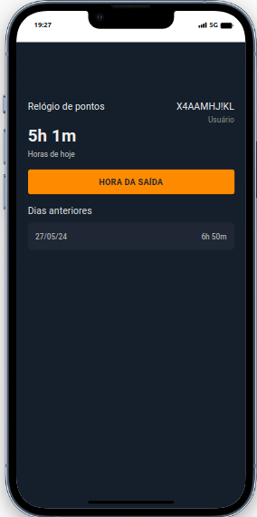
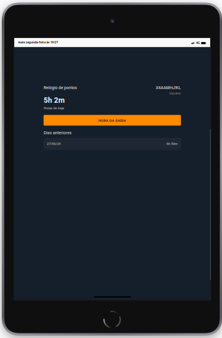
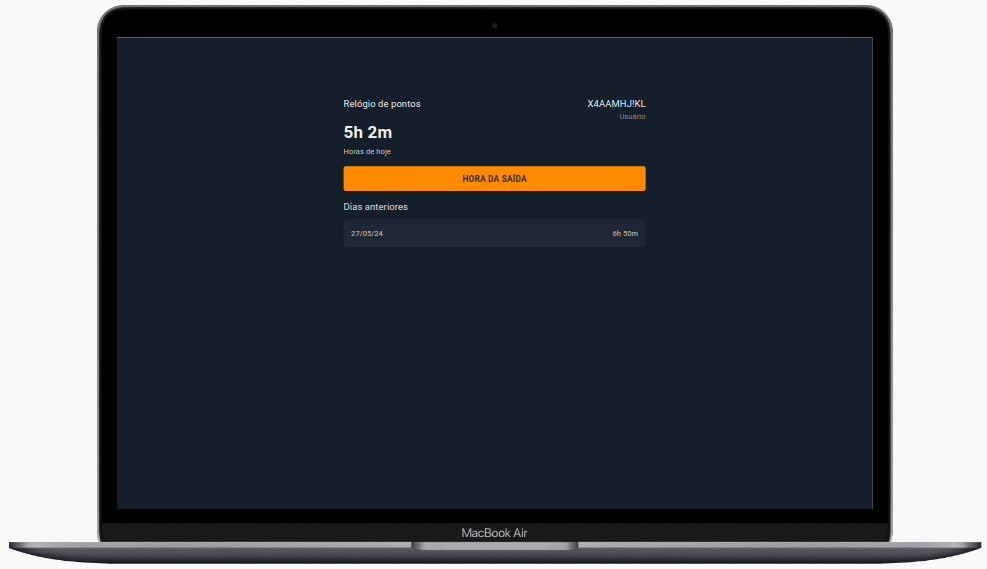

# React + TypeScript + Vite

### Para iniciar o projeto

#### Instalar
 yarn ou npm install

#### Iniciar 
yarn dev

<<<<<<< HEAD
# Tela de Login
|                                     |                                     |
|-------------------------------------|-------------------------------------|
|  |  |

Tela de Home

=======
## Para rodar o frontend 
yarn dev

#### rodar nodocker 
docker compose up -d --build
ou 
#### acessar o arquivo Makefile e seguir os comandos
make build
>>>>>>> 9a1e5e5 (feat: create file docker container)
